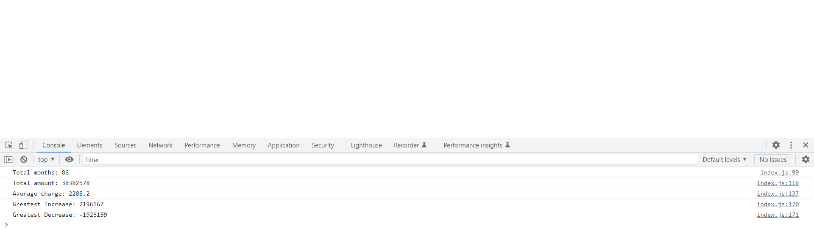

# Unit 4 Challenge: Console Finances

## Overview

In this challenge, I will be using the concepts I have learned to complete the required activity. This activity presents a real-world situation in which my newfound JavaScript skills will come in handy. I am tasked with creating code for analyzing the financial records of a company. 

Financial data have been provided with a financial dataset in the `starter/index.js` file.

## Instructions

1. I will be creating a new GitHub repo called `Console-Finances`. Then, clone it to my computer.

2. I will need to the starter files in your local git repository.
   
3. I have been given a dataset composed of arrays with two fields, Date and Profit/Losses.

4. My task is to write JavaScript code that analyzes the records to calculate each of the following:

* The total number of months included in the dataset.

* The net total amount of Profit/Losses over the entire period.

* The average of the **changes** in Profit/Losses over the entire period.
  * I will need to track what the total change in profits are from month to month and then find the average.
  * (`Total/Number of months`)

* The greatest increase in profits (date and amount) over the entire period.

* The greatest decrease in losses (date and amount) over the entire period.

When the browser is opened my resulting analysis should look similar to the following:

  ```text
  Financial Analysis
  ----------------------------
  Total Months: 25
  Total: $2561231
  Average  Change: $-2315.12
  Greatest Increase in Profits: Feb-2012 ($1926159)
  Greatest Decrease in Profits: Sep-2013 ($-2196167)
  ```



[Deployed Link](https://lawzstopwar.github.io/Console-Finances/)


